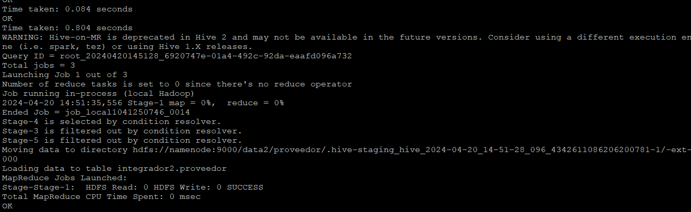
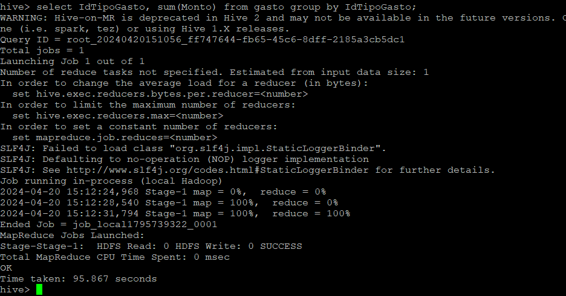
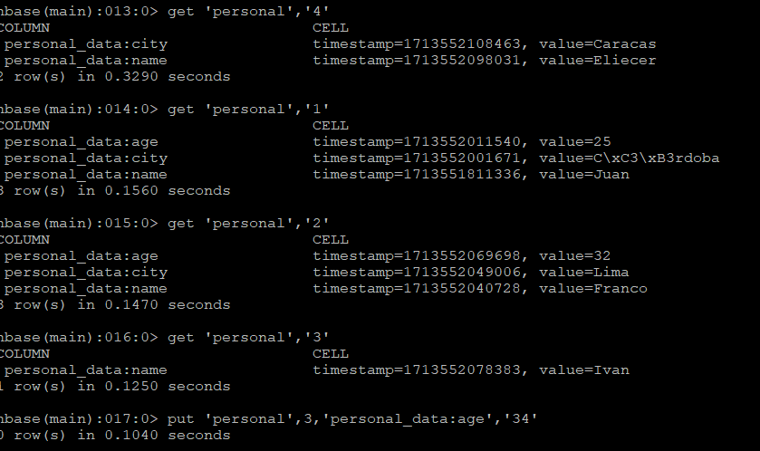
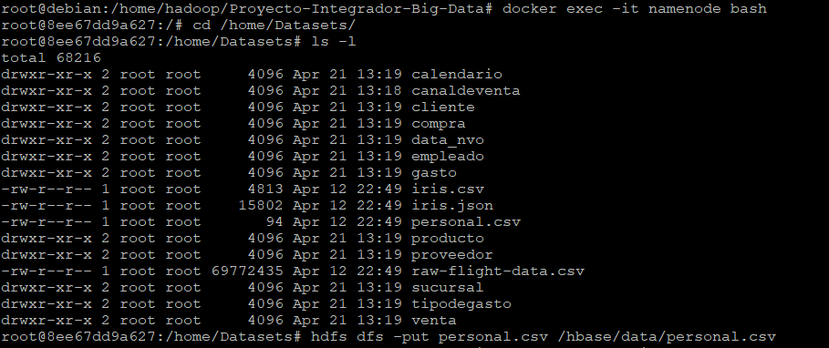

<div align="center">
  <h1 align="center">
    Viaje hacia la analítica avanzada con Big Data: La clave del éxito
    <br />
    <br />
      
  </h1>
</div>

<p align="center">
   <br />
   
   <br />
</p>

## Contenido

* [Introducción](#Introducción)

* [Implementación](#Implementación)

* [1. HDFS](#1-HDFS)

* [2. HIVE](#2-HIVE)

* [3. Formatos de Almacenamiento](#3-Formatos-de-Almacenamiento)

* [4. SQL](#4-SQL)

* [5. No SQL](#5-No-SQL)

* [6. Spark](#6-Spark)

* [7. Carga incremental con Spark](#7-Carga-incremental-con-Spark)

* [8. Herramientas de orquestación de flujos de datos](#8-Herramientas-de-orquestación-de-flujos-de-datos)

* [Glosario](#Glosario)

* [Recursos](#Recursos)

* [Créditos](#Créditos)


## Introducción

En la era de la información, las empresas necesitan herramientas para procesar y analizar grandes volúmenes de datos. El Big Data ofrece una solución para extraer información valiosa de estos conjuntos de datos, lo que permite tomar mejores decisiones y optimizar procesos.
Beneficios de usar herramientas de Big Data:

- **Mejora en la toma de decisiones**: Permite identificar patrones y tendencias que de otra manera serían invisibles.
- **Optimización de procesos**: Ayuda a identificar áreas de ineficiencia y desarrollar soluciones para mejorarlas.
- **Ventaja competitiva**: Diferencia a las empresas de sus competidores.

La implementación de un MVP de Big Data utilizando Docker es una excelente manera de demostrar el valor de esta tecnología y puede conducir a la adopción de soluciones de Big Data en toda la empresa, lo que puede generar importantes beneficios para el negocio.

### La implementación de un MVP de Big Data utilizando Docker ofrece las siguientes ventajas:

- **Bajo costo**: Docker es una plataforma de código abierto que no requiere de licencias costosas. Esto permite implementar un entorno de Big Data de manera económica.
- **Escalabilidad**: Docker permite escalar fácilmente el entorno de Big Data para adaptarse a las necesidades del negocio.
- **Flexibilidad**: Docker permite desarrollar e implementar aplicaciones de Big Data de manera rápida y sencilla.
- **Portabilidad**: Docker permite implementar aplicaciones de Big Data en cualquier entorno, ya sea en la nube o en un servidor local.

En resumen, la implementación de un MVP de Big Data utilizando Docker es una excelente manera de demostrar el valor de esta tecnología a la gerencia de infraestructura. Esta iniciativa puede conducir a la adopción de soluciones de Big Data en toda la empresa, lo que puede generar importantes beneficios para el negocio.


## Entorno Docker con Hadoop, Spark y Hive
## Se pesenta un entorno Docker con Hadoop (HDFS) y la implementación de:

- **Spark**
- **Hive**
- **HBase**
- **MongoDB**
- **Neo4J**
- **Zeppelin**
- **Kafka**

La implementación completa de este proyecto requiere de un entorno con recursos considerables, podemos adaptar la propuesta para ajustarla a las capacidades del equipo que servira para tal fin. Para ello, se plantearán unos pasos prácticos en entornos reducidos, cuidadosamente seleccionados en función de las herramientas utilizadas. De esta manera, podrán familiarizarse con las funcionalidades y el potencial del proyecto sin sobrecargar los recursos informáticos.

## Implementación

verificar la interface de Red de docker. Ejecute el siguiente comando en la terminal de linux :

```bash
sudo docker network ls
```

Se debe mostrar una lista de red, incluyendo la del proyecto, sino,  es porque aun no se ha mostrado

<p align="center">
    
</p>

Inspeccionemos la red para encontrar la IP en la que se publican las intefaces de hadoop</p>

```bash
sudo docker network inspect proyecto-integrador-big-data_default
```

Y observe

<p align="center">
    
</p>


<p>
Namenode: http://ip_servidor:9870/dfshealth.html#tab-overview</br>
Datanode: http://ip_servidor:9864/</br>
Spark master: http://ip_servidor:8080/</br>
Spark worker: http://ip_servidor:8081/</br>
HBase Master-Status: http://ip_servidor:16010</br>
HBase Zookeeper_Dump: http://ip_servidor:16010/zk.jsp</br>
HBase Region_Server: http://ip_servidor:16030</br>
Zeppelin: http://ip_servidor:8888</br>
Neo4j: http://ip_servidor:7474</br>
<p>


- **Paso 1**. Clonamos el repositorio para iniciar el proceso de implementación del entorno de prueba o demostración

<p> .: </p>

```bash
sudo git clone https://github.com/ing-jhparra/Proyecto-Integrador-Big-Data.git
```

<p align="center">
    
</p>

- **Paso 1.1**: Cambiamos al directorio del repositorio creado

```bash
cd Proyecto-Integrador-Big-Data
```

- **Paso 1.2** Ejecutamos docker-compose-vX.yml con X = 1. Cabe resaltar que X, toma un valor dependiendo del entorno que se quiere implementar 

```bash
sudo docker-compose -f docker-compose-v1.yml up -d
```

# 1 HDFS

- **Paso 2**. Con la ejecución del paso anterior hemos implemetado un entorno HDFS, ahora ingresamos al **Namenode** para crear un directorio llamado **Datasets**  que va almacenar los archivos csv

```bash
sudo docker exec -it namenode bash
```
luego ejecutamos el siguiente comando 

```bash
sudo mkdir /home/Datasets
```
Es importante mencionar que cada archivo csv se encontrara en un subdirectorio que lleva su nombre por tanto se debe crear el directorio en question para calendario, canaldeventa, cliente, compra, data_nvo, empleado, gasto, producto, proveedor, sucursal, tipodegasto, tiposdegasto y venta. Al ejecutar el Paso 2.2 de este tutorial deberia obtener el resultado que se muestra en la siguiente imagen 

<p align="center">
    
</p>
	 
**Paso 2.1**. Copiar los archivos ubicados en la carpeta Datasets, dentro del contenedor **namenode** ejecutando el siguiente comando

```bash
sudo sh Paso00.sh
```

El paso anterio crea los subdirectorio y copiar los archivos en **namenode**


**Paso 2.2**. Nos conectamos a **namenode**

```bash
sudo docker exec -it namenode bash
```

**Paso 2.3**. Creamos un directorio **/data** en el sistema de archivo HDFS de Hadoop de **namenode**

```bash
hdfs dfs -mkdir -p /data
```

**Paso 2.4**. Copiamos los archivos csv contenidos en Datasets en el directorio provistos (/data) en HDFS:

```bash
hdfs dfs -put /home/Datasets/* /data
```

**NOTA** : Se encuentra en desarrollo la automatización de este paso, creacion y copia de archvios a **/data**


**Paso 2.5**. Desde un navegador web escriba la dirección **http://Colocar-IP-del-Servidor:9870** para entrar a Hadoop

<p align="center">
    
</p>

**Paso 2.6**. Hacer clic en **Utilities - Configuration** para entrar a la configuración <p>

<p align="center">
    
</p>

**Paso 2.7**. Busque los valores del bloque y el factor de réplica:</p>

**dfs.blocksize** 

<p align="center">
    
</p>

**dfs.replication**

<p align="center">
    
</p>

Puede también buscar otras configuraciones que necesite conocer del sistema Hadoop

# 2 HIVE

**Paso 3**. Creamos las tablas en Hive, a partir de los csv ingestados en HDFS. Para ello copiamos el archivo **Paso02.hql** en **/home** del contenedor **hive-server** ejecutando el siguiente comando 

```bash
docker cp Paso02.hql hive-server:/home/
```

**Paso 3.1**. Ingresamos al nodo **hive-server** 

```bash
sudo docker exec -it hive-server bash
```

luego en el contendor ejecutamos

```bash
hive –f /home/Paso02.hql
```

**Paso 3.2**. Ingresamos a Hive para verificar tablas y los datos

```bash
hive
```

Para las tablas, escribimos

```bash
hive>use integrador;
```

luego

```bash
hive>show tables;
```

<p align="center">
    
</p>

Verificamos la inserccion de datos en las tablas, podemos utilizar un select, en conjuncion de una funcion de agregación **count(*)**

```bash
hive>select * from canal_venta;
```

<p align="center">
    
</p>

```bash
hive>select count(*) from canal_venta;
```

<p align="center">
    
</p>

 # 3 Formatos de Almacenamiento

En el paso 3 fueron creadas las tablas a partir de los archivos csv, ahora crearemos unas tablas utilizando un formato **Parquet** con **Snappy** para cumplir debemos ejecutar el **Paso03.hql**, en este ejercicio utilizamso el concepto de particionamiento en la tabla venta.

**Paso 4**. Ejecutamos **Paso03.hql** para crear la base de datos **integrador2** y las tablas con formatos **parquet** con **snappy** y la tabla **gasto** particionada

```bash
hive -f Paso03.hql;
```

<p align="center">
    
</p>

luego colocamos en uso la base de datos **integrador2** y ejecutamos un select a la tabla **gasto** que esta particionada por la clave **IdTipoGasto**

```bash
select IdTipoGasto, sum(Monto) from gasto group by IdTipoGasto;
```
**NOTA:** Por el tipo de ejercicio, se esta utilizando pocos datos, por lo cual, no se puede evidenciar el tiempo de respuesta para demostrar el rendimiento que ofrece el formato parquet con snnapy y con particionamiento

<p align="center">
    
</p>

 # 4 SQL

 La mejora en la velocidad de consulta que puede proporcionar un índice tiene el costo del procesamiento adicional para crear el índice y el espacio en disco para almacenar las referencias del índice. Se recomienda que los índices se basen en las ***columnas que utiliza en las condiciones de filtrado (where)***. El índice en la tabla puede degradar su rendimiento en caso de que no los esté utilizando. Creamos un índices en alguna de las tablas cargadas y probamos los resultados:

 Puede utilizar el siguiente script para crear su indice

```bash
 CREATE INDEX index_name
 ON TABLE base_table_name (col_name, ...)
 AS index_type
 [WITH DEFERRED REBUILD]
 [IDXPROPERTIES (property_name=property_value, ...)]
 [IN TABLE index_table_name]
 [ [ ROW FORMAT ...] STORED AS ...
 | STORED BY ... ]
 [LOCATION hdfs_path]
 [TBLPROPERTIES (...)]
 [COMMENT "index comment"];
```

Para realizar alguna modificación sobre su indice utilice :

```bash
ALTER INDEX index_name ON table_name [PARTITION partition_spec] REBUILD;
```
Ejemplo 

hive> ALTER INDEX index_students ON students REBUILD; 

Para borrar el indice 

```bash
DROP INDEX [IF EXISTS] index_name ON table_name;
```

Ejemplo 

hive> DROP INDEX IF EXISTS index_students ON students; 

 **Paso 4**. Creamos un indice y ejecutamos un select para observar el tiempo de respuesta

```bash
CREATE INDEX index_venta_producto ON TABLE venta(IdProducto) 
AS 'org.apache.hadoop.hive.ql.index.compact.CompactIndexHandler' WITH DEFERRED REBUILD;
```

luego realizamos una consulta sobre venta

```bash
select IdProducto, SUM(Precio * Cantidad) FROM venta GROUP BY IdProducto; 
```
Y observamos el tiempo de ejecución

seguido, creamos los índices correspondientes en la tabla venta y cliente:

```bash
CREATE INDEX index_venta_producto ON TABLE venta(IdProducto) AS 'org.apache.hadoop.hive.ql.index.compact.CompactIndexHandler' WITH DEFERRED REBUILD;
```

# 5 No SQL

Continuamos en el entorno ya creado

### HBase

**Paso 5**. Creamos una tabla en HBase, insertamos algunos valores y la consultamos

**Instrucciones**:

```bash
docker exec -it hbase-master hbase shell
```

create 'personal','personal_data'
list 'personal'
put 'personal',1,'personal_data:name','Juan'
put 'personal',1,'personal_data:city','Córdoba'
put 'personal',1,'personal_data:age','25'
put 'personal',2,'personal_data:name','Franco'
put 'personal',2,'personal_data:city','Lima'
put 'personal',2,'personal_data:age','32'
put 'personal',3,'personal_data:name','Ivan'
put 'personal',3,'personal_data:age','34'
put 'personal',4,'personal_data:name','Eliecer'
put 'personal',4,'personal_data:city','Caracas'
get 'personal','4'

<p align="center">
    
</p>

**Paso 5.1**. En el **namenode** del cluster copiamos el archivo **personal.csv** al directroio **/data** de **HDFS**:

```bash
hdfs dfs -put personal.csv /hbase/data/personal.csv
```
<p align="center">
    
</p>

### MongoDB

**Instrucciones**:

**Paso 6**. Copiamos los archivos iris.csv e iris.json al nodo de mongodb

```bash
sudo docker cp iris.csv mongodb:/data/iris.csv
sudo docker cp iris.json mongodb:/data/iris.json
```
**Paso 6.1**. Ingresamos al nodo de mongodb

```bash
sudo docker exec -it mongodb bash
```
**Paso 6.2**. Importamos los archivos iris.csv e iris.json

```bash
mongoimport /data/iris.csv --type csv --headerline -d dataprueba -c iris_csv
mongoimport --db dataprueba --collection iris_json --file /data/iris.json --jsonArray
```
**Paso 6.3**. Entramos al motor de consulta de MongoDB

```bash
mongosh
```
**Paso 6.4**. Colocamos en uso la base de datos dataprueba y mostramos las tablas

```bash
use dataprueba;
show collections	
```
**Paso 6.5**. Consultmaos las dolecciones (tablas)

```bash
db.iris_csv.find()
db.iris_json.find()	
```
**Paso 6.6**. Exportamos las colecciones desde MongoDB

```bash
mongoexport --db dataprueba --collection iris_csv --fields sepal_length,sepal_width,petal_length,petal_width,species --type=csv --out /data/iris_export.csv
mongoexport --db dataprueba --collection iris_json --fields sepal_length,sepal_width,petal_length,petal_width,species --type=json --out /data/iris_export.json	
```
**Nota**: De necesitarse descargar los driver, utilizar los siguietnes enlaces

- https://search.maven.org/search?q=g:org.mongodb.mongo-hadoop
- https://search.maven.org/search?q=a:mongo-hadoop-hive
- https://search.maven.org/search?q=a:mongo-hadoop-spark

**Paso 6.7**. Copiamos los archivos jar al nodo mongodb

```bash
sudo docker cp mongo-hadoop-hive-2.0.2.jar hive-server:/opt/hive/lib/mongo-hadoop-hive-2.0.2.jar
sudo docker cp mongo-hadoop-core-2.0.2.jar hive-server:/opt/hive/lib/mongo-hadoop-core-2.0.2.jar
sudo docker cp mongo-hadoop-spark-2.0.2.jar hive-server:/opt/hive/lib/mongo-hadoop-spark-2.0.2.jar
sudo docker cp mongo-java-driver-3.12.11.jar hive-server:/opt/hive/lib/mongo-java-driver-3.12.11.jar	
```

**Paso 6.8**. Copiamos el archivo iris.hql al nodo hive-server

```bash
sudo docker cp iris.hql hive-server:/opt/iris.hql
sudo docker exec -it hive-server bash
```
**Paso 6.9**. Otorgamos permisos y ejecutamos el archivo hql

```bash
hiveserver2
chmod 777 iris.hql
hive -f iris.hql
``` 	

### Neo4J

<h4 align="center">
:construction: Tema en fase de desarrollo y prueba :construction:
</h4>

### Zeppelin

<h4 align="center">
:construction: Tema en fase de desarrollo y prueba :construction:
</h4>

# 6 Spark

<h4 align="center">
:construction: Tema en fase de desarrollo y prueba :construction:
</h4>

## Spark y Scala

<h4 align="center">
:construction: Tema en fase de desarrollo y prueba :construction:
</h4>

## Kafka

<h4 align="center">
:construction: Tema en fase de desarrollo y prueba :construction:
</h4>

## Comparativa Dataset y Dataframe en Scala

<h4 align="center">
:construction: Tema en fase de desarrollo y prueba :construction:
</h4>

##  ETL con Spark

<h4 align="center">
:construction: Tema en fase de desarrollo y prueba :construction:
</h4>

# 7 Carga incremental con Spark

<h4 align="center">
:construction: Tema en fase de desarrollo y prueba :construction:
</h4>

# 8 Herramientas de orquestación de flujos de datos

<h4 align="center">
:construction: Tema en fase de desarrollo y prueba :construction:
</h4>

## Glosario :

Ciertos términos se utilizan en Open MCT con significados o convenciones consistentes. Cualquier desviación de lo siguiente es un problema y debe abordarse (ya sea actualizando este glosario o cambiando el código para reflejar el uso correcto). Otra documentación para desarrolladores, particularmente la documentación en línea, puede presumir la comprensión de estos términos.


- **Big Data**: Conjunto de datos extremadamente grande y complejo que es difícil de procesar y analizar utilizando métodos tradicionales.

- **Herramientas de código abierto**: Software disponible gratuitamente para su uso, modificación y distribución.

- **MVP (Producto Mínimo Viable)**: Versión inicial de un producto con las características básicas necesarias para satisfacer a los primeros usuarios.

- **Docker**: Plataforma de virtualización de software que permite ejecutar aplicaciones en contenedores aislados.

- **Hadoop**: Marco de software de código abierto para el almacenamiento y procesamiento distribuido de grandes conjuntos de datos.

- **Spark**: Motor de procesamiento de datos distribuido de código abierto para el análisis de grandes conjuntos de datos.

- **Hive**: Almacén de datos distribuido que permite consultar y analizar datos almacenados en HDFS.

- **HBase**: Base de datos NoSQL distribuida para el almacenamiento de grandes conjuntos de datos estructurados.

- **MongoDB**: Base de datos NoSQL de código abierto para el almacenamiento de documentos JSON.

- **Neo4J**: Base de datos de grafos de código abierto para el almacenamiento y análisis de relaciones entre entidades.

- **Zeppelin**: Notebook interactivo para el análisis de datos que admite Spark, Hive y otras herramientas.

- **Kafka**: Plataforma de mensajería de código abierto para el manejo de flujos de datos en tiempo real.

- **HDFS (Hadoop Distributed File System)**: Sistema de archivos distribuido para el almacenamiento de grandes conjuntos de datos en múltiples nodos.

- **Data Lake**: Almacén centralizado de datos en bruto que puede almacenar cualquier tipo de dato sin necesidad de un esquema predefinido.

- **Datamart**: Subconjunto de un Data Lake que contiene datos estructurados y procesados para un análisis específico.

- **ETL (Extract, Transform, Load)**: Proceso de extracción de datos de una fuente, transformación de los datos para su análisis y carga de los datos en un destino.

- **Machine Learning**: Rama de la inteligencia artificial que permite a los sistemas aprender de los datos sin ser programados explícitamente.

- **Deep Learning**: Subconjunto de Machine Learning que utiliza redes neuronales artificiales para el aprendizaje de patrones complejos en los datos.

- **Inteligencia Artificial**: Rama de la informática que busca crear sistemas inteligentes que puedan razonar, aprender y actuar de forma autónoma.

- **Escalabilidad**: Capacidad de un sistema para aumentar o disminuir su capacidad de procesamiento o almacenamiento para adaptarse a la demanda.

- **Portabilidad**: Capacidad de un sistema para ejecutarse en diferentes entornos, como en la nube o en un servidor local.

- **Alta disponibilidad**: Capacidad de un sistema para estar disponible de forma continua y minimizar el tiempo de inactividad.

- **Seguridad**: Capacidad de un sistema para proteger los datos y recursos de accesos no autorizados.

- **Gobernanza de datos**: Conjunto de políticas y procesos para garantizar la calidad, integridad y seguridad de los datos.


## Recursos

* https://github.com/sercasti/datalaketools
* https://www.aluracursos.com/blog/como-escribir-un-readme-increible-en-tu-github
* https://github.com/soyHenry/DS-M4-Herramientas_Big_Data

## Créditos

Copyright (c) 2024 [Ing. Jesús parra] parra.jesus@gmail.com