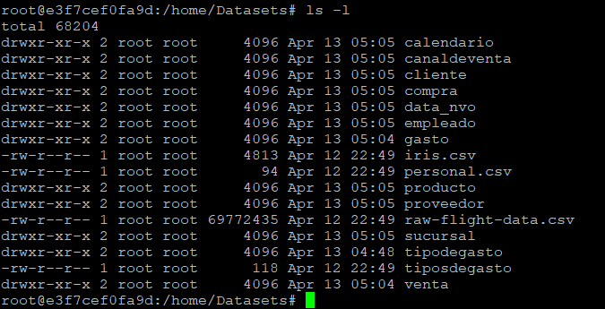

<h1><strong>Viaje hacia la analítica avanzada con Big Data: La clave del exito.</strong></h1>

    

<h1>Introducción</h1> 

<h3>Aprovechando el poder del Big Data con herramientas de código abierto</h3>

En la era actual, donde la información es poder, las empresas que buscan mantenerse a la vanguardia necesitan herramientas que les permitan procesar y analizar grandes volúmenes de datos de manera eficiente. El Big Data ofrece una solución innovadora para extraer información valiosa de estos conjuntos de datos, lo que permite tomar decisiones más acertadas y optimizar procesos.

Sin embargo, la implementación de soluciones de Big Data puede generar dudas, especialmente en lo que respecta a los costos. En este caso, la propuesta de construir un MVP (Producto Mínimo Viable) de un entorno de Big Data utilizando Docker presenta una oportunidad única para demostrar las ventajas de esta tecnología sin necesidad de grandes inversiones.

<h3>A continuación, se detallan algunos de los beneficios de utilizar herramientas de Big Data:</h3>

<ul>
	<li>
	<b>Mejora en la toma de decisiones</b>: El análisis de grandes volúmenes de datos permite identificar patrones y tendencias que de otra manera serían invisibles. Esta información puede ser utilizada para tomar decisiones estratégicas más informadas que conduzcan al éxito del negocio.
	</li>
	<li>
	<b>Optimización de procesos</b>: El Big Data puede ayudar a identificar áreas de ineficiencia en los procesos operativos y desarrollar soluciones para mejorarlos. Esto puede conducir a ahorros significativos en costos y a una mayor productividad.
	</li>
	<li>
	<b>Ventaja competitiva</b>: Las empresas que adoptan el Big Data se encuentran a la vanguardia de la innovación y pueden diferenciarse de sus competidores. Esto puede conducir a una mayor cuota de mercado y a un mayor crecimiento.
	</li>
</ul>

<h3>La implementación de un MVP de Big Data utilizando Docker ofrece las siguientes ventajas:</h3>

<ul>
<li>
<b>Bajo costo</b>: Docker es una plataforma de código abierto que no requiere de licencias costosas. Esto permite implementar un entorno de Big Data de manera económica.
</li>
<li>
<b>Escalabilidad</b>: Docker permite escalar fácilmente el entorno de Big Data para adaptarse a las necesidades del negocio.
</li>
<li>
<b>Flexibilidad</b>: Docker permite desarrollar e implementar aplicaciones de Big Data de manera rápida y sencilla.
</li>
<li>
<b> Portabilidad</b>: Docker permite implementar aplicaciones de Big Data en cualquier entorno, ya sea en la nube o en un servidor local.
</li>
</ul>

En resumen, la implementación de un MVP de Big Data utilizando Docker es una excelente manera de demostrar el valor de esta tecnología a la gerencia de infraestructura. Esta iniciativa puede conducir a la adopción de soluciones de Big Data en toda la empresa, lo que puede generar importantes beneficios para el negocio.

<h2>Entorno Docker con Hadoop, Spark y Hive</h2>
<h2>Se pesenta un entorno Docker con Hadoop (HDFS) y la implementación de:</h2>
<ul>
<li>Spark</li>
<li>Hive</li>
<li>HBase</li>
<li>MongoDB</li>
<li>Neo4J</li>
<li>Zeppelin</li>
<li>Kafka</li>
</ul>

La implementación completa de este proyecto requiere de un entorno con recursos considerables, podemos adaptar la propuesta para ajustarla a las capacidades del equipo que servira para tal fin. Para ello, se plantearán pasos prácticos en entornos reducidos, cuidadosamente seleccionados en función de las herramientas utilizadas. De esta manera, podrán familiarizarse con las funcionalidades y el potencial del proyecto sin sobrecargar los recursos informáticos. 

<b>Paso 0. Verificación de interface de Red</b>. Ejecute los siguientes comando en la terminal de linux :

equipo$ sudo docker network ls

Se mostrara una lista de interfaces, tome nota de la interface relacionada

    

Hagamos una inspeccion para encontrar la IP en la que se publican las intefaces de hadoop

    

Namenode: http://ip_servidor:9870/dfshealth.html#tab-overview 
Datanode: http://ip_servidor:9864/ 
Spark master: http://ip_servidor:8080/ 
Spark worker: http://ip_servidor:8081/ 
HBase Master-Status: http://ip_servidor:16010 
HBase Zookeeper_Dump: http://ip_servidor:16010/zk.jsp 
HBase Region_Server: http://ip_servidor:16030 
Zeppelin: http://ip_servidor:8888 
Neo4j: http://ip_servidor:7474 

<b>Paso 1</b>. Para implementar el entorno ejecute los siguientes comando

 .: Clonamos el repositorio

equipo$ git clone https://github.com/ing-jhparra/Proyecto-Integrador-Big-Data.git

    

 .: Cambiamos al directorio del repositorio creado

equipo$ cd Proyecto-Integrador-Big-Data

 .: Ejecutamos el docker-compose-v(x).yml con x = 1. Cabe resaltar que x, tomara los valores 1,2,3,4 

equipo/Proyecto-Integrador-Big-Data:$ sudo docker-compose -f docker-compose-v1.yml up -d
 

<h2>1. HDFS</h2>

<b>Paso 2</b>. En este paso ejecute el entorno docker-compose-v1.yml, dentro del directorio Proyecto-Integrador-Big-Data, luego
                  en el nodo recien creado <b>namenode</b> se debe crear un directorio en /home llamado Datasets que tambien tendra otros subdirectorios, cuyo nombres estan relacionado a cada nombre dearchivo csv

equipo/Proyecto-Integrador-Big-Data:$ sudo docker exec -it namenode bash

root@e3f7cef0fa9d:# cd /home

root@e3f7cef0fa9d:/home# mkdir Datasets

root@e3f7cef0fa9d:/home/Datasets# mkdir calendario

Continue ejecutando para crear los subdirectorios : canaldeventa, cliente, compra, data_nvo, empleado, gasto, producto, proveedor, sucursal, tipodegasto, tiposdegasto, venta. Quedando de esta manera

    

	 
<b>Copiar los archivos ubicados en la carpeta Datasets, dentro del contenedor "namenode" ejecutando las sentencias</b> 

docker cp ./gasto/Gasto.csv namenode:/home/Datasets/gasto 
docker cp ./venta/Venta.csv namenode:/home/Datasets/venta 
docker cp ./producto/Producto.csv namenode:/home/Datasets/producto 
docker cp ./canaldeventa/CanalDeVenta.csv namenode:/home/Datasets/canaldeventa 
docker cp ./tipodegasto/TiposDeGasto.csv namenode:/home/Datasets/tiposdegasto 
docker cp ./sucursal/Sucursal.csv namenode:/home/Datasets/sucursal 
docker cp ./cliente/Cliente.csv namenode:/home/Datasets/cliente 
docker cp ./empleado/Empleado.csv namenode:/home/Datasets/empleado 
docker cp ./proveedor/Proveedor.csv namenode:/home/Datasets/proveedor 
docker cp ./compra/Compra.csv namenode:/home/Datasets/compra 
docker cp ./data_nvo/Producto.csv namenode:/home/Datasets/data_nvo 
docker cp ./data_nvo/Empleado.csv namenode:/home/Datasets/data_nvo 
docker cp ./data_nvo/Cliente.csv namenode:/home/Datasets/data_nvo 
docker cp ./calendario/Calendario.csv namenode:/home/Datasets/calendario 
docker cp ./iris.csv namenode:/home/Datasets/./iris.csv 
docker cp ./personal.csv namenode:/home/Datasets/./personal.csv 
docker cp ./raw-flight-data.csv namenode:/home/Datasets/./raw-flight-data.csv 

<b>Nota</b>: Este proceso de copia de archivo se puede realizar a través de un archivo shell script

<b>Paso 3</b>. Entrar al contenedor namenode

equipo/Proyecto-Integrador-Big-Data:$ sudo docker exec -it namenode bash

sudo docker exec -it namenode bash
	

<b>Paso 4</b>. Creamos un directorio en HDFS llamado "/data".

hdfs dfs -mkdir -p /data

<b>Paso 5</b>. Copiamos los archivos csv contenidos en Datasets en el directorio provistos en HDFS:

hdfs dfs -put /home/Datasets/* /data

<b>Nota</b>: Este proceso de creación de la carpeta data y copiado de los arhivos, debe poder ejecutarse desde un shell script.

<b>Paso 5</b>. Ahora desde un navegador web escriba la dirección http://ip_servidor:9870 para entrar a Hadoop 

    

Haga clic en Utilities Configuration para entrar a la configuración 

    

Busque en esa página los valores que toman el tamaño del bloque y el factor de réplica:

dfs.blocksize
 

    

dfs.replication

    

Y puede también buscar otras configuraciones que necesite conocer del sistema Hadoop

<h2>2. HIVE</h2>

<b>Paso 6</b>. Creamos las tablas en Hive, a partir de los csv ingestados en HDFS. Para ello debemos copiar el archivo <b>Paso02.hql</b> en <b>/home</b> del contenedor <b>hive-server</b> ejecutamos el comando para copiar

docker cp Paso02.hql hive-server:/home/

<b>Paso 7</b>. Ingresamos al nodo
 

sudo docker exec -it hive-server bash

luego en el contendor ejecutamos 

hive –f /home/Paso02.hql

<b>Paso 8</b>. Ingresamos a Hive para verificar tablas y los datos

hive

<b>Paso 8</b>. Escribimos

hive>use integrador;

luego 

hive>show tables;

    

Verifiquemos la inserccion de datos en las tablas, podemos utilizar un simple select o en conjuncion con la funcion coun(*)

SELECT * FROM canal_venta;

    

SELECT COUNT(*) FROM canal_venta;

    

https://github.com/sercasti/datalaketools
